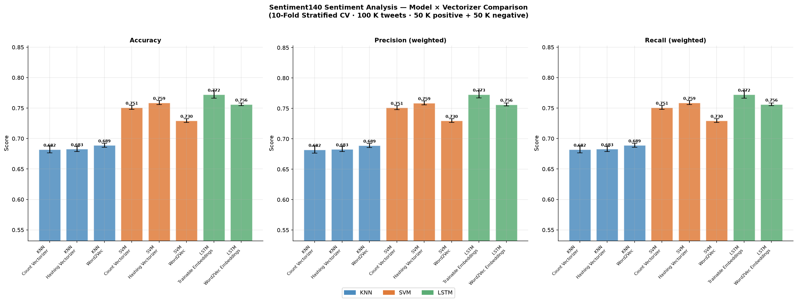
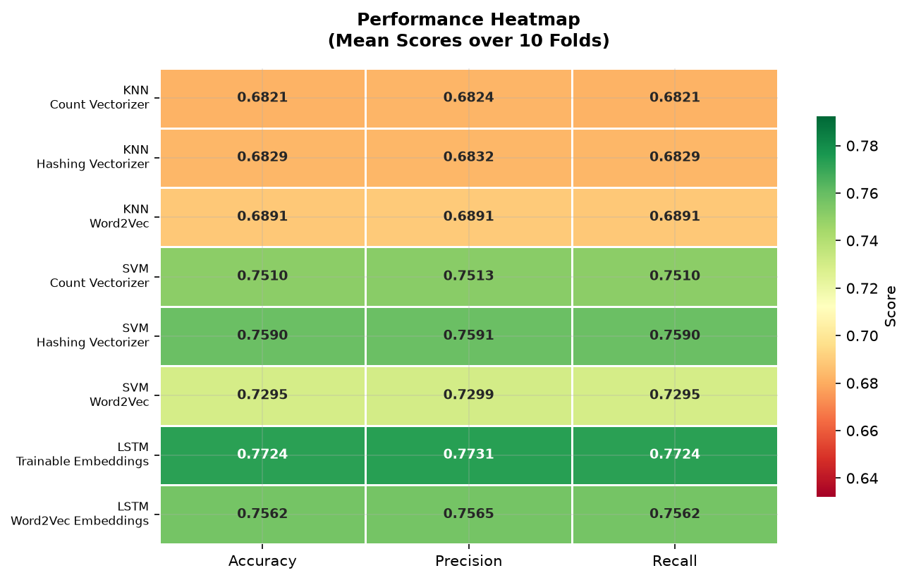
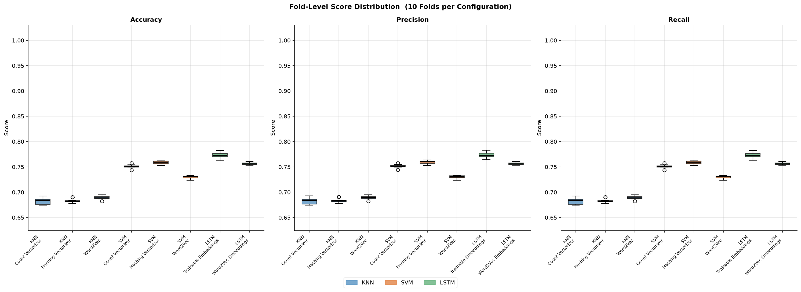
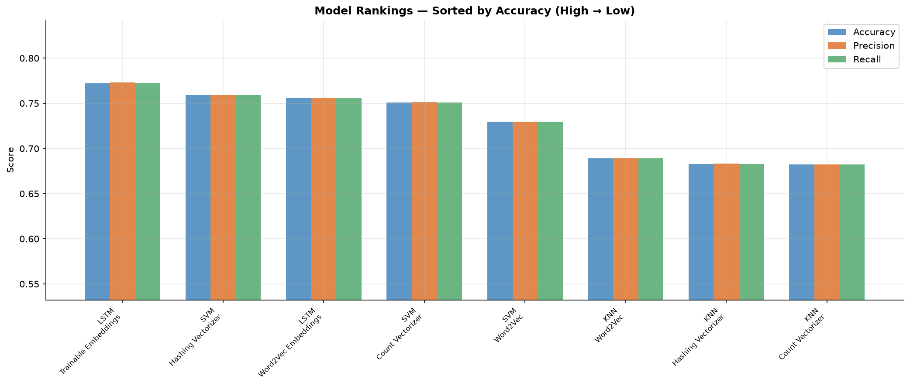
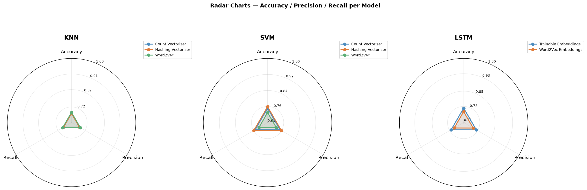

# Sentiment Analysis — Detailed Experiment Report

**Dataset:** Sentiment140 · 100,000 tweets (50K positive + 50K negative)  
**Evaluation:** 10-Fold Stratified Cross-Validation  
**Metrics:** Accuracy · Precision (weighted) · Recall (weighted)  
**Hardware:** Apple M1 · TensorFlow-Metal GPU

---

## Table of Contents

1. [Dataset & Preprocessing](#1-dataset--preprocessing)
2. [Vectorization Strategies](#2-vectorization-strategies)
3. [Model Configurations](#3-model-configurations)
4. [Results Summary](#4-results-summary)
5. [Per-Model Analysis](#5-per-model-analysis)
6. [Fold-Level Stability](#6-fold-level-stability)
7. [Visual Analysis](#7-visual-analysis)
8. [Key Takeaways](#8-key-takeaways)

---

## 1. Dataset & Preprocessing

### Sentiment140
- **Source:** Stanford Twitter Sentiment corpus — 1.6M tweets labelled by emoticons
  - `:)` and variants → positive (label 4)
  - `:(` and variants → negative (label 0)
- **Sample used:** 50,000 negative + 50,000 positive (stratified, random_state=42)

### Preprocessing Pipeline

| Step | Action | Reason |
|---|---|---|
| Lowercase | `"Happy"` → `"happy"` | Normalise surface forms |
| URL removal | `https://...` → removed | No sentiment signal |
| @mention removal | `@user` → removed | Metadata, not sentiment |
| #hashtag removal | `#topic` → removed | Mostly metadata |
| Emoji removal | 😊 → removed | Label derived from emoji; avoid double-counting |
| HTML entity removal | `&amp;` → removed | Encoding artefacts |
| Tokenisation | NLTK `word_tokenize` | Split into word units |
| Lemmatisation | `running` → `run`, `better` → `good` | Reduce vocabulary |
| Stop-word removal | NLTK English list — **negations kept** | See note below |

> **Negation preservation:** Words like `not`, `never`, `don't`, `isn't`, `wouldn't` are **excluded from the stop-word list**. Without this, "not good" becomes "good" — reversing the sentiment. This is one of the most common bugs in sentiment pipelines.

---

## 2. Vectorization Strategies

### Count Vectorizer (Bag-of-Words)
- `max_features = 50,000` — top 50K most frequent tokens
- `min_df = 2` — ignore tokens appearing in fewer than 2 documents
- `ngram_range = (1, 2)` — unigrams + bigrams
- Captures: "not good", "very bad", "love it" as single features

### Hashing Vectorizer
- `n_features = 2¹⁷ = 131,072` buckets
- `ngram_range = (1, 2)`
- Stateless — no vocabulary built; maps tokens directly to buckets via hash
- Advantage: works on streaming data; no fit required

### Word2Vec Averaging
- Trained on the full preprocessed corpus
- `vector_size = 100`, `window = 5`, `min_count = 2`, `epochs = 5`
- Each tweet represented as the **mean** of its word vectors → 100-dim dense vector
- Captures semantic similarity ("happy" ≈ "joyful") but loses word order

### LSTM Embedding (Trainable)
- Keras `Tokenizer` with `num_words = 30,000`
- `Embedding(30001, 128, glorot_uniform)` — 3.84M parameters learned end-to-end
- Sequences padded / truncated to `max_len = 50`
- Tokeniser fitted only on the **training fold** (no leakage)

### LSTM Embedding (Word2Vec-initialised, Frozen)
- Same Keras tokeniser as above
- Embedding weights pre-loaded from the Word2Vec model (100-dim)
- `trainable = False` — weights frozen; LSTM learns on top of fixed representations

---

## 3. Model Configurations

### KNN — K-Nearest Neighbours

```
k            = 5
metric       = cosine similarity
LSA dims     = 150  (TruncatedSVD applied before KNN on sparse vectors)
```

Cosine similarity is used because text vectors differ in magnitude (longer tweets → larger vectors). Cosine measures angle, not length — so a short and long tweet on the same topic are considered similar. LSA reduces the 50K-dim BoW to 150 latent topic dimensions to avoid the curse of dimensionality.

### SVM — Linear Support Vector Machine

```
C            = 1.0   (regularisation; lower = wider margin)
max_iter     = 3000
solver       = LinearSVC (primal, fast for large text datasets)
```

Finds the hyperplane with maximum margin separating positive from negative tweets. With BoW/Hash features, each word/bigram is a dimension and the model learns a weight per feature — high weight on "amazing" → predicts positive.

### LSTM — Bidirectional Long Short-Term Memory

```
Embedding dim        = 128 (trainable) / 100 (Word2Vec)
LSTM units           = 128 per direction  →  256-dim output (bidirectional)
Spatial dropout      = 0.3  (on embedding output)
LSTM input dropout   = 0.2
Dense hidden         = 64 units, ReLU
Dense dropout        = 0.4
Output               = 1 unit, Sigmoid
```

**Bidirectional** means two LSTMs run in parallel — one left→right, one right→left. Each word gets context from both its past and future tokens. Critical for sentences like *"The movie was not as bad as I expected — I loved it"* where the final sentiment depends on the full sequence.

**Training:**

```
Optimiser            = Adam (lr=1e-3, clipnorm=1.0)
Loss                 = binary_crossentropy
Callbacks:
  EarlyStopping      patience=5, restore_best_weights=True
  ReduceLROnPlateau  factor=0.5, patience=2
Max epochs           = 20
Batch size           = 128
```

---

## 4. Results Summary

> All scores are **mean ± std** over 10 stratified folds.

| Rank | Model | Vectorizer | Accuracy | Precision | Recall |
|:---:|---|---|:---:|:---:|:---:|
| 🥇 | **LSTM** | **Trainable Embeddings** | **77.24% ± 0.62%** | **77.31% ± 0.59%** | **77.24% ± 0.62%** |
| 🥈 | SVM | Hashing Vectorizer | 75.90% ± 0.33% | 75.91% ± 0.33% | 75.90% ± 0.33% |
| 🥉 | SVM | Count Vectorizer | 75.10% ± 0.33% | 75.13% ± 0.34% | 75.10% ± 0.33% |
| 4 | LSTM | Word2Vec Embeddings | 75.62% ± 0.23% | 75.65% ± 0.23% | 75.62% ± 0.23% |
| 5 | SVM | Word2Vec | 72.95% ± 0.30% | 72.99% ± 0.30% | 72.95% ± 0.30% |
| 6 | KNN | Word2Vec | 68.91% ± 0.33% | 68.91% ± 0.33% | 68.91% ± 0.33% |
| 7 | KNN | Hashing Vectorizer | 68.29% ± 0.41% | 68.32% ± 0.42% | 68.29% ± 0.41% |
| 8 | KNN | Count Vectorizer | 68.21% ± 0.58% | 68.24% ± 0.59% | 68.21% ± 0.58% |

---

## 5. Per-Model Analysis

### KNN — 68.2% to 68.9%

All three vectorizers perform similarly (~68%), with Word2Vec averaging slightly better than sparse BoW. The consistent gap vs. SVM/LSTM confirms that KNN's lazy, distance-based approach struggles with the non-linear decision boundaries in sentiment data.

```
Count Vectorizer   68.21% ▓▓▓▓▓▓▓▓▓▓▓▓▓▓▓▓▓▓▓▓▓▓▓▓▓▓▓▓▓▓▓▓▓▓
Hashing Vectorizer 68.29% ▓▓▓▓▓▓▓▓▓▓▓▓▓▓▓▓▓▓▓▓▓▓▓▓▓▓▓▓▓▓▓▓▓▓
Word2Vec           68.91% ▓▓▓▓▓▓▓▓▓▓▓▓▓▓▓▓▓▓▓▓▓▓▓▓▓▓▓▓▓▓▓▓▓▓▌
```

### SVM — 72.9% to 75.9%

SVM shows a clear vectorizer effect. Hashing Vectorizer (75.90%) beats Count Vectorizer (75.10%) slightly — both use bigrams and perform similarly. Word2Vec averaging (72.95%) is noticeably weaker because averaging 100-dim vectors loses order information and mixes positive/negative signals within a tweet.

```
Count Vectorizer   75.10% ▓▓▓▓▓▓▓▓▓▓▓▓▓▓▓▓▓▓▓▓▓▓▓▓▓▓▓▓▓▓▓▓▓▓▓▓▓▓
Hashing Vectorizer 75.90% ▓▓▓▓▓▓▓▓▓▓▓▓▓▓▓▓▓▓▓▓▓▓▓▓▓▓▓▓▓▓▓▓▓▓▓▓▓▓▌
Word2Vec           72.95% ▓▓▓▓▓▓▓▓▓▓▓▓▓▓▓▓▓▓▓▓▓▓▓▓▓▓▓▓▓▓▓▓▓▓▓▓
```

**Notable:** SVM + Hashing (75.90%) trains in seconds and sits only ~1.3 points below the best LSTM. For production use cases where speed matters, this is a compelling tradeoff.

### LSTM — 75.6% to 77.2%

Trainable embeddings (77.24%) outperform frozen Word2Vec embeddings (75.62%) by 1.6 points. The model learns word representations specifically optimised for sentiment — something generic Word2Vec embeddings (trained on co-occurrence, not sentiment) cannot fully capture.

```
Trainable Embeddings 77.24% ▓▓▓▓▓▓▓▓▓▓▓▓▓▓▓▓▓▓▓▓▓▓▓▓▓▓▓▓▓▓▓▓▓▓▓▓▓▓▓
Word2Vec Embeddings  75.62% ▓▓▓▓▓▓▓▓▓▓▓▓▓▓▓▓▓▓▓▓▓▓▓▓▓▓▓▓▓▓▓▓▓▓▓▓▓▓
```

**Training behaviour (LSTM Trainable, 10 folds):**

| Fold | Val Accuracy | Stopped at Epoch |
|:---:|:---:|:---:|
| 1 | 77.51% | 6 |
| 2 | 77.44% | 7 |
| 3 | 77.23% | 7 |
| 4 | 77.99% | 6 |
| 5 | 77.53% | 7 |
| 6 | 77.74% | 7 |
| 7 | 76.45% | 6 |
| 8 | 76.76% | 6 |
| 9 | 76.73% | 7 |
| 10 | 77.10% | 7 |
| **Mean** | **77.25%** | — |
| **Std** | **±0.46%** | — |

Very low standard deviation (±0.46%) — the model is stable across all 10 different data splits.

---

## 6. Fold-Level Stability

Low standard deviation = the model generalises well, not just getting lucky on one split.

| Model | Vectorizer | Accuracy Std | Stability |
|---|---|:---:|---|
| LSTM | Word2Vec Embeddings | **±0.23%** | Excellent |
| SVM | Hashing Vectorizer | ±0.33% | Excellent |
| SVM | Count Vectorizer | ±0.33% | Excellent |
| SVM | Word2Vec | ±0.30% | Excellent |
| KNN | Word2Vec | ±0.33% | Good |
| LSTM | Trainable Embeddings | ±0.62% | Good |
| KNN | Hashing Vectorizer | ±0.41% | Good |
| KNN | Count Vectorizer | ±0.58% | Moderate |

All models show low variance — the 10-fold CV protocol gives reliable estimates. KNN with Count Vectorizer shows the most variance (±0.58%), likely because its performance is more sensitive to which tweets land in the training vs. validation fold.

---

## 7. Visual Analysis

### Overall Metrics Comparison



All three metrics (accuracy, precision, recall) move together for each configuration — the dataset is perfectly balanced (50/50), so there's no precision-recall tradeoff to manage. The LSTM bar stands clearly tallest.

---

### Performance Heatmap



The heatmap makes the model hierarchy immediately visible:
- **Green band (top):** LSTM trainable, SVM + Hashing/Count
- **Yellow band (middle):** LSTM Word2Vec, SVM Word2Vec
- **Orange/Red band (bottom):** All KNN configurations

---

### Fold-Level Score Distribution



Box plots reveal score distributions across all 10 folds. Narrow boxes = stable model. Wide boxes = sensitive to which data ends up in which fold. All SVM variants show tight boxes; LSTM trainable is slightly wider due to the stochastic nature of neural network initialisation.

---

### Model Rankings



Configurations sorted left-to-right by accuracy. The steep drop from SVM to KNN (~7 points) and the small gap between SVM and LSTM (~1.3 points) are the two most striking patterns.

---

### Radar Charts



Radar charts show the balance between accuracy, precision, and recall per model family. All three metrics are nearly identical for each configuration on this balanced dataset, forming near-perfect equilateral triangles.

---

## 8. Key Takeaways

### 1. Deep learning wins — but not by a landslide
LSTM (77.24%) leads SVM (75.90%) by only **1.34 percentage points**, while requiring ~100× more training time. For production deployment with latency constraints, LinearSVC + Hashing is highly competitive.

### 2. Vectorization matters more than model choice for KNN
All KNN variants cluster around 68%, regardless of vectorizer. The model's fundamental limitation (distance-based, no learned boundary) dominates over the vectorization choice.

### 3. Trainable embeddings beat Word2Vec for task-specific learning
LSTM + Trainable (77.24%) > LSTM + Word2Vec frozen (75.62%). Word2Vec is trained on word co-occurrence; the trainable variant optimises embeddings directly for sentiment — giving it a 1.6-point edge.

### 4. Bigrams are essential for SVM on sentiment data
The `ngram_range=(1,2)` setting captures negation patterns ("not good", "don't like") as single features. Without bigrams, the SVM would see "not" and "good" as separate, potentially conflicting signals.

### 5. Stability = real generalisation
With 10-fold CV and std below ±0.62% for all models, these results reflect true generalisation performance — not a lucky train/test split.

---

*Runtime: ~3.5 hours total on Apple M1 (GPU via tensorflow-metal). LSTM folds: ~12 min each. KNN/SVM folds: seconds each.*
